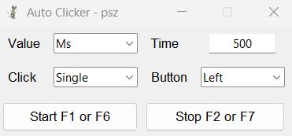

# Repclick
A simple autoclicker made for automating repetitive tasks in gaming (my in-game name is 'psz').

---

## Features
- Customizable Interval: Set the interval for automatic clicks in milliseconds, seconds, or minutes.
- Click Type: Choose between single or double-clicks.
- Mouse Button: Select either left or right mouse button for clicks.
- Keyboard Shortcuts: Use F1/F6 to start and F2/F7 to stop the autoclicker.
- Adjustable Timing: Set specific times for click intervals, with checks to prevent unrealistic settings.

---

### Usage
1. Launch the application.
2. Set your desired click interval, click type, and button.
3. Press Start to begin autoclicking, or use F1/F6 to start it.
4. Press Stop to halt the autoclicker, or use F2/F7 to stop it.

---

#### False Positive Warning
The EXE file may be flagged by antivirus software as a potential threat due to how new executables are sometimes detected.

However, the script is safe and contains no malicious code. You can verify this by reviewing the source code.
